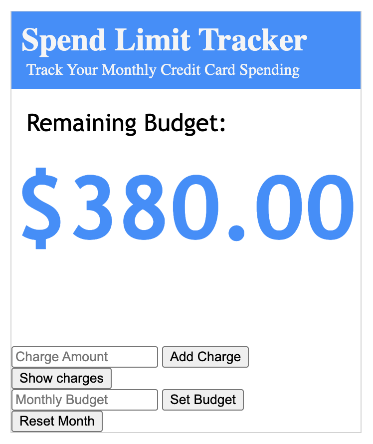

# spend-limit-tracker
Spend Limit Tracker

A simple budgeting application built with vanilla JavaScript.

Features:
- Set a monthly spending budget
- Add charges with the current date
- Automatically calculate remaining budget
- View or hide charge history
- Delete individual charges
- Reset the month with confirmation
- Save budget and charges using Local Storage

Built as part of my computer science portfolio while learning JavaScript and web development.

What I Learned: 
- DOM manipulation
- Event listneners
- HTML ids
- Javascript objects and arrays
- Local Storage
- Separating application responsibilities
- Git and GitHub workflow

Future Improvements:
- Mobile-responsive design
- Import transactions automatically from credit card accounts
- Support multiple credit cards
