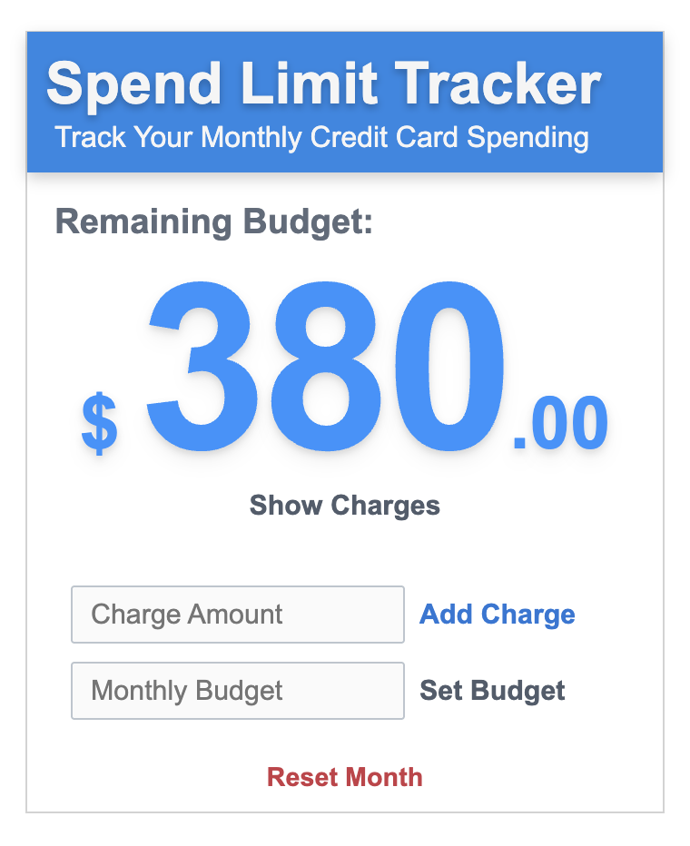

# Spend Limit Tracker



A browser-based budgeting application built with **HTML, CSS, and vanilla JavaScript** that helps users track monthly spending against a predefined budget.

The application stores all data locally using the browser's **Local Storage API**, allowing budgets and transactions to persist between sessions without requiring a backend or database.

---

## Features

- Set a monthly spending budget
- Add charges with the current date
- Automatically calculate the remaining budget
- View or hide charge history
- Delete individual charges
- Reset the month with confirmation
- Save all data using Local Storage

---

## Technologies Used

- HTML5
- CSS3
- JavaScript (ES6)
- Local Storage API
- Git
- GitHub

---

## Installation

1. Clone this repository.

```bash
git clone https://github.com/randystormes/spend-limit-tracker.git
```

2. Navigate to the project folder.

```bash
cd spend-limit-tracker
```

3. Open `index.html` in your browser.

No additional dependencies or installation are required.

---

## Usage

1. Enter your monthly budget.
2. Add charges as purchases are made.
3. Watch the remaining budget update automatically.
4. Show or hide your transaction history.
5. Reset the month when starting a new budget cycle.

---

## What I Learned

This project was built to strengthen my JavaScript fundamentals while creating something that solves a real budgeting problem.

While building it I practiced:

- Manipulating the DOM with JavaScript
- Working with arrays and objects to manage application state
- Using event listeners to create an interactive interface
- Persisting data with the Local Storage API
- Organizing HTML, CSS, and JavaScript into separate responsibilities
- Iterating on user interface design based on feedback
- Using Git and GitHub to manage versions of a project

One of the biggest lessons from this project was that good software isn't only about functionality. Through multiple design revisions I learned how typography, spacing, color hierarchy, and reducing unnecessary visual elements can make an application significantly easier to use.

---

## Future Improvements

Version 2 is planned to focus on reducing manual data entry by improving the overall workflow.

Planned improvements include:

- Connect bank accounts to automatically import transactions
- Remove manual charge entry
- Automatically calculate remaining budget from imported transactions.
- Redesign the transaction list with a cleaner, always-available view.
- Improve the mobile experience

---

## Author

**Randy Stormes**

Computer Science student at Western Governors University

GitHub: https://github.com/randystormes